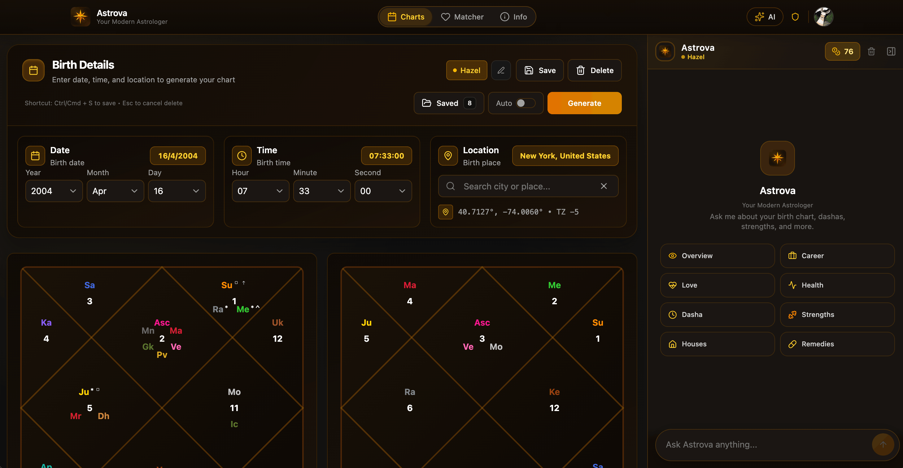

# Astrova ✨

**AI-powered Vedic Astrology platform** — Generate birth charts (Kundali), get AI interpretations, and explore compatibility matching.

   

<p align="center">
  
</p>

## 🌟 Features

- **Birth Chart Generation** — Accurate Vedic astrology charts using Swiss Ephemeris calculations
- **AI Interpretations** — Get detailed readings powered by advanced language models
- **Compatibility Matching** — Traditional Kundali matching with Ashtakoot scoring
- **Save & Manage Charts** — Persistent storage for multiple birth charts
- **Real-time Charts** — Live planetary positions with auto-refresh
- **Knowledge Base** — Learn about Vedic astrology concepts

## 🛠️ Tech Stack

- **Frontend:** React 18, TypeScript, Vite, TailwindCSS
- **Backend:** Vercel Edge Functions, Neon PostgreSQL
- **Auth:** Firebase Authentication (centralized via Magnova)
- **AI:** OpenRouter (GPT-4, Claude, etc.)
- **Ephemeris:** Swiss Ephemeris for astronomical calculations

## 🚀 Getting Started

### Prerequisites

- Node.js 18+
- pnpm (recommended) or npm
- Neon PostgreSQL database
- Firebase project

### Installation

```bash
# Clone the repository
git clone https://github.com/omkarbhad/astrova.git
cd astrova

# Install dependencies
pnpm install

# Set up environment variables
cp .env.example .env.local

# Run development server
pnpm dev
```

### Environment Variables

Create a `.env.local` file with:

```env
# Database
DATABASE_URL=postgresql://...

# OpenRouter API
VITE_OPENROUTER_API_KEY=sk-or-...

# Firebase (optional - uses centralized auth)
VITE_FIREBASE_API_KEY=...
VITE_FIREBASE_PROJECT_ID=...
```

## 📁 Project Structure

```
astrova/
├── src/
│   ├── components/     # React components
│   ├── contexts/       # React contexts (Auth, Credits)
│   ├── pages/          # Page components
│   ├── lib/            # Utilities and API clients
│   └── styles/         # Global styles
├── api/                # Vercel Edge Functions
│   ├── _lib/           # Shared utilities
│   ├── charts.ts       # Chart CRUD
│   ├── kundali.ts      # Chart generation
│   └── chat.ts         # AI chat
└── public/             # Static assets
```

## 🔐 Authentication

Astrova uses centralized authentication via [Magnova Auth](https://auth.magnova.ai). Users sign in once and get access to all Magnova apps.

## 📊 API Endpoints

| Endpoint | Method | Description |
|----------|--------|-------------|
| `/api/kundali` | POST | Generate birth chart |
| `/api/charts` | GET/POST | List/save charts |
| `/api/charts/[id]` | GET/PUT/DELETE | Chart operations |
| `/api/chat` | POST | AI interpretation |
| `/api/models` | GET | Available AI models |

## 🤝 Contributing

Contributions are welcome! Please read our contributing guidelines before submitting PRs.

## 📄 License

MIT License — see [LICENSE](LICENSE) for details.

## 🔗 Links

- **Live App:** [astrova.magnova.ai](https://astrova.magnova.ai)
- **Magnova:** [magnova.ai](https://magnova.ai)
- **Author:** [@omkarbhad](https://github.com/omkarbhad)

---

Built with ❤️ by [Magnova](https://magnova.ai)
